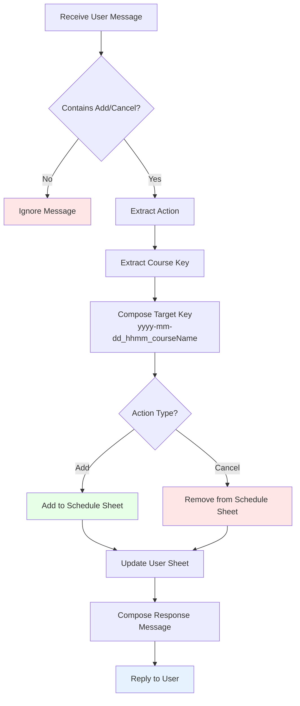

The purpose of this project is to help my Yoga class instructor to manage bi-weekly schedule on Google Sheet.

This LINE Bot utilizes Line Message API and Google App Script. It reads user message in a group chat, interprete user's actions by rules, and update Google Sheets (course schedule and user files).

Ideally, LINE Bot will be able to take over the workflow shown above and handle course scheduling. A flowchart below illustrates what this project does on the high level.

A screenshot of this project (seal is the bot):

In additional to the project codebase, a LINE Access Token, Google Sheet ([example](https://docs.google.com/spreadsheets/d/1ttMUhEpUvvrrrxgq1MsoADe6zaalyjrVj12pB4JJaFU/edit?usp=sharing)) and a Google Drive folder ([example](https://drive.google.com/drive/folders/1UDs6RcVO7lEZiphgDU4saItggqoG-w47?usp=sharing)) that contains user files are needed. They are defined as, `CHANNEL_ACCESS_TOKEN`, `SCHEDULE_URL` and `USER_FOLDER_ID`, respectively, in Google App Script script properties or the local `.env` file.

## Development & Testing

Tests are done in local Node.js environment with the help of [clasp](https://developers.google.com/apps-script/guides/clasp) and [gas-local](https://www.npmjs.com/package/gas-local) library.

Logs are sent to Google Cloud Platform. Set it in App Script project setttings -> Google Cloud Platform

